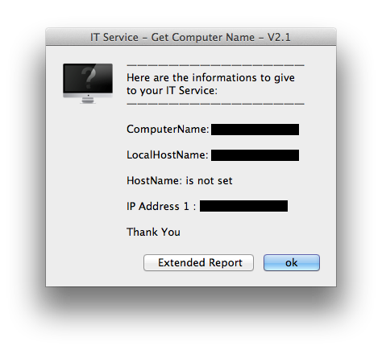
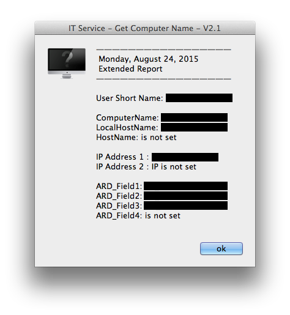

#Get Computer Name

###Usage

This AppleScript Application will help your User(s) to get some usefull info of their Mac so they can give it to you and so you can take Remote Access via ARD.

It will show following informations:

- ComputerName
- LocalHostName
- HostName
- IP Address 1

There is also an "Extended Report" that will also give other infos :

- IP Address 2
- ARD fields

###Customize the App:

This Apple script is editable with Applescript Editor if you like.

If you wish to rename the App, you'll have to change the App name accordingly in the **Info.plist** file.

####Localization:

The App is localized in English and in French.
If you want to chnage the messages, files are in the bundle file of the App.

	GetComputerName.app/Contents/Resources/

in Folders

	English.lproj

or

	French.lproj

If you wish to add languages do so in the same folder, copy and paste the **Localizable.strings** from English.lproj or French.lproj

####Application Icon

As git can't deal Mac iconr files, the App Icon is not saved, and you'll have an Applescript Icon.

If you want the App to have a nicer icon - of your choice or the one I use - rather than an Applescript icon, you'll find a **GetComputerName_icon.png** file in the **Ressources** Folder.

1. Open the png file in Preview
2. Select All 
3. Copy ( Command-C )
4. Go Back to Finder and Show Info for the App.
5. Select the icon in the information window
6. Paste ( Command-V )

The App now has a customized icon.

####Window Icon

An icon is also showed in the App window.

If you want to change it accordingly to your custom icon.

1. Go Back to Finder and Show Info for the App.
2. Select the icon in the information window
3. Copy ( Command-C )
4. Go to Preview
5. Paste ( Command-V ) - you'll have a multiple "icon" file.
6. Save the new file as an icon with the name **applet.icns**
7. Copy/replace this **applet.icns** in the 	`GetComputerName.app/Contents/Resources/applet.icns`

Now, you should have the same icon than the App showing up in you Window.

